# Wavelet-Compression
MATLAB Implementation of Integer Binary Haar Wavelet and Integer Ternary Haar Wavelet
All codes are written by myself. 

### Setup
This project is tested on MATLAB 2018

```
MATLAB2018 
```

### Run
```
wavelet 
```
All the outputs are generated under "output" folder. 

## Result
Since wavelet is lossless compression, the output results are all the same as below. 
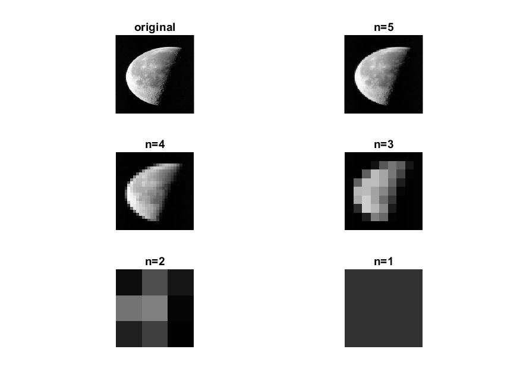
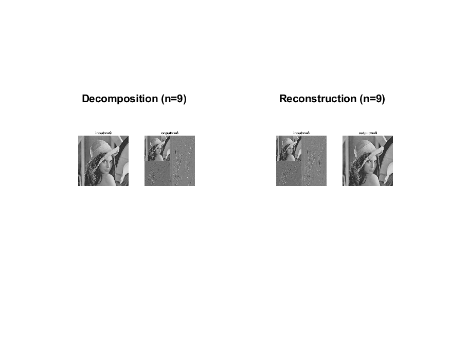
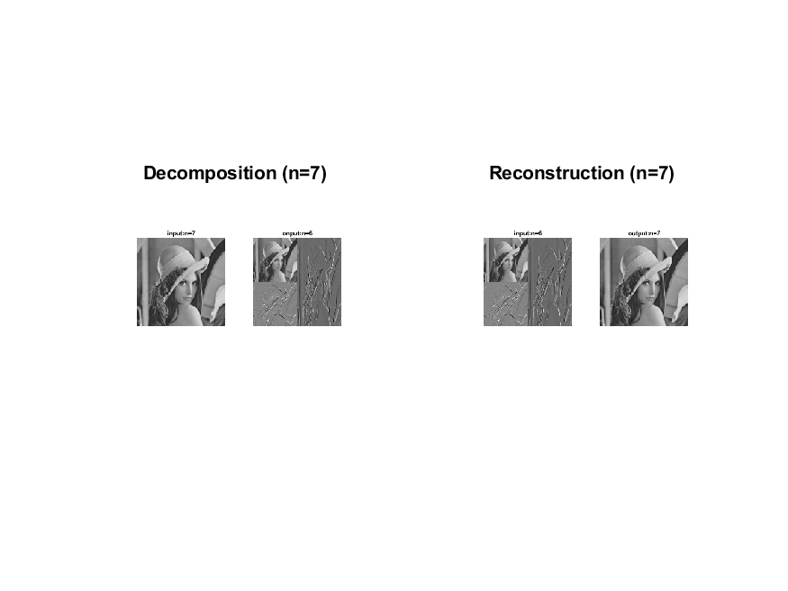
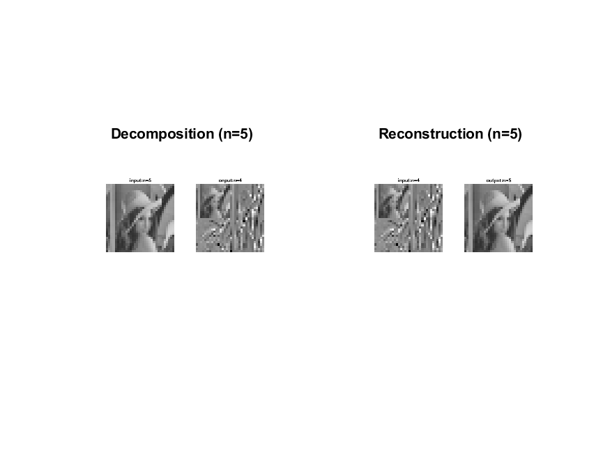
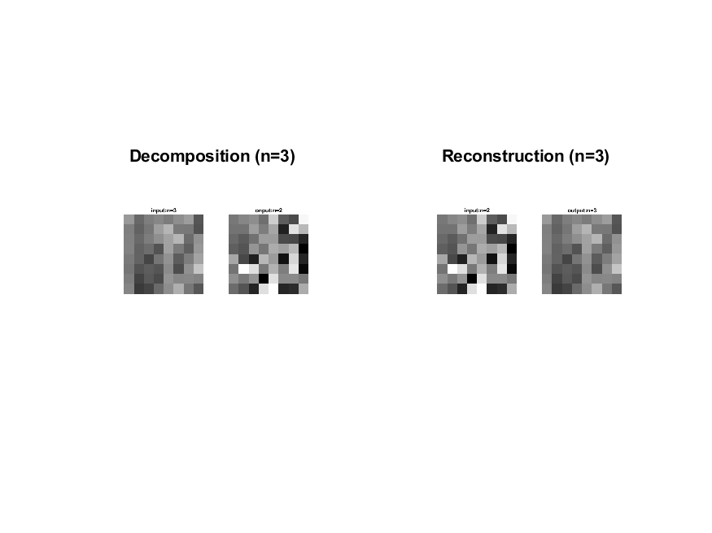
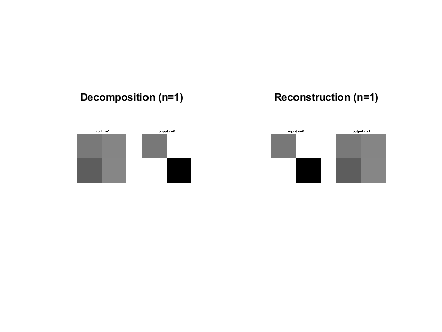


### Non-Integer Binary Haar Wavelet 
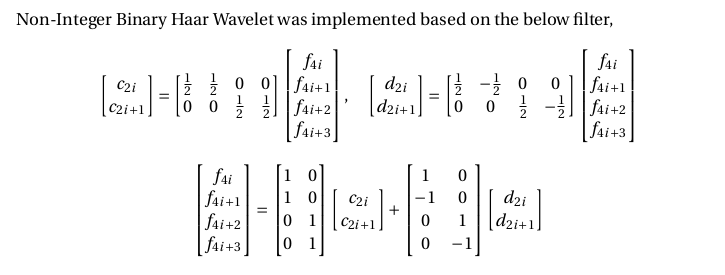 
### Integer Binary Haar Wavelet 
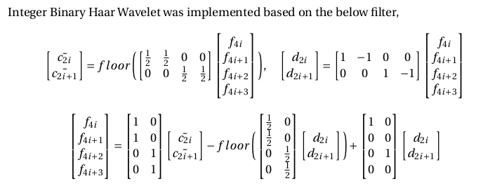 
### Integer Tarnary Haar Wavelet 
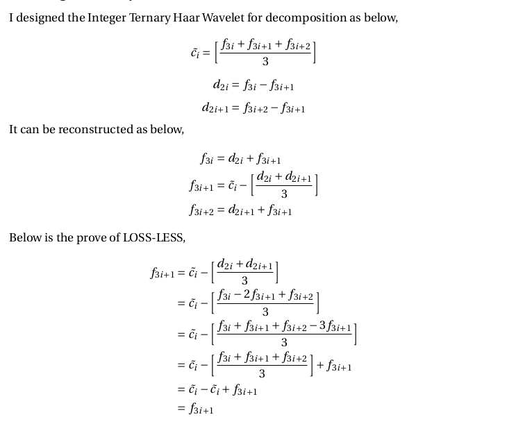 
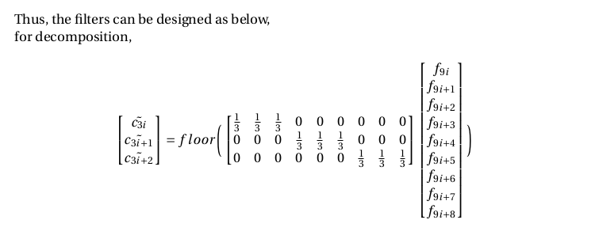 
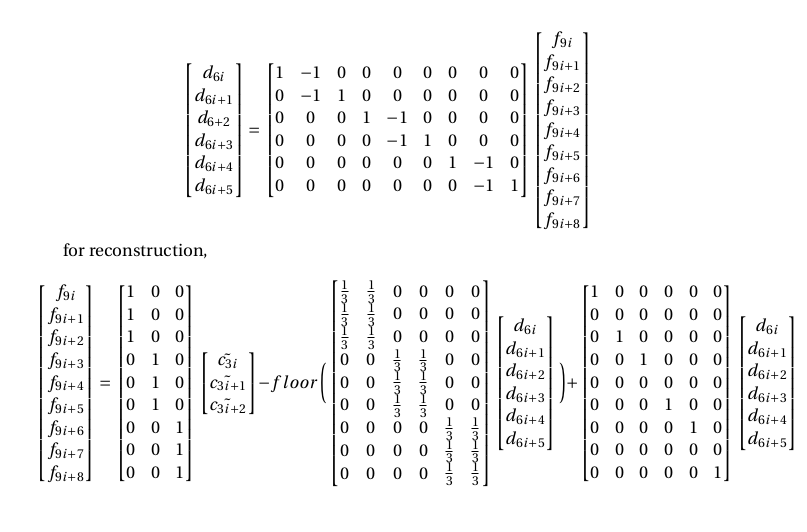 


## Author

Suhong Kim – [@github](https://github.com/suhongkim) – suhongkim11@gmail.com \
Distributed under the MIT license. See the [LICENSE.md](LICENSE.md) file for details

## Inspiration
This project is a part of the CMPT743 assignments at SFU. My implementation is poisson_blend.m, and others are from the skeleton [code](https://drive.google.com/file/d/1rSOQUHlr4j6_6t22hyBRFSaWaRqseNcs/view).\
Please check [the website](https://sites.google.com/site/alimahdaviamiri/teaching/cmpt-743) if you need. 

